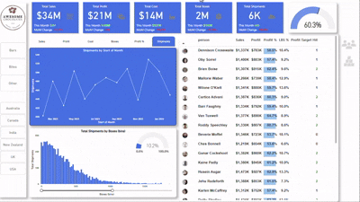

# Awesome Chocolates - Global Sales Performance Dashboard (Power BI)

This repository contains a professional-level Power BI Dashboard built for Awesome Chocolates, a multinational chocolate manufacturing company. The goal of this project is to analyze and interpret key sales performance indicators, optimize operations, and support strategic business decisions across regions, product categories, and sales teams.

---

## Executive Summary

The Awesome Chocolates dashboard provides a consolidated view of key performance metrics including total sales, profits, costs, and shipping volume. This comprehensive, data-driven solution enables stakeholders to quickly assess performance trends and take action based on data insights.

This report is based on historical data from multiple business functions such as finance, sales, and logistics, and is designed to answer critical business questions like:

- How are sales trending across months and regions?
- Which sales representatives are performing best?
- How efficient are shipments and logistics?
- Which products or regions are underperforming?

### Key Business Metrics (Cumulative)

| Metric                | Value   | Monthly Change | MoM Change % |
|-----------------------|---------|----------------|--------------|
| Total Sales           | $34M    | $3M            | -10.1%       |
| Total Profit          | $21M    | $1.08M         | -5.0%        |
| Total Cost            | $14M    | $2.09M         | -19.2%       |
| Total Boxes           | 2M      | 143K           | -11.4%       |
| Total Shipments       | 6K      | 469            | -11.0%       |
| Profit Target Hit     | 60.3%   | —              | —            |

This dashboard empowers decision-makers to identify high-performing areas, control operational inefficiencies, and align performance with targets.

---

## Business Insights

| Area                     | Insight                                                                 |
|--------------------------|-------------------------------------------------------------------------|
| Sales Trend              | A visible decline in sales in the most recent month. Likely seasonality. |
| Profit Trend             | Profits decreased moderately, with cost reduction softening the impact. |
| Top Sales Reps           | Dennison Crosswaite, Oby Sorrel, and Brian Boise lead in both sales and profit. |
| Least Efficient Reps     | Several reps failed to meet profitability targets.                     |
| Shipments Trend          | Shipment volume shows fluctuations tied to peak seasons.                |
| Distribution Analysis    | Majority of shipments are in smaller box categories. Long tail observed.|
| Regional Performance     | Strongest regions include the USA and Australia. India and NZ underperform. |

---

  

## Deep-Dive Analysis

### Sales by Month

The line graph for monthly shipments indicates cyclic sales behavior, with spikes in May and November. A downward trend in the most recent month may require intervention from sales or marketing departments.

### Shipments by Box Size

Histogram data indicates the company ships many smaller boxes with relatively few high-volume shipments. This may affect operational costs, storage planning, and shipping logistics.

### Profitability by Sales Representative

Salespeople are evaluated not just by revenue but also their contribution to profit and their ability to hit targets.

- **Dennison Crosswaite**: High sales, high profit, high LBS% (58.5%)
- **Brian Boise**: Slightly lower revenue but excellent LBS % and consistent profitability
- **Roddy Speechley**: Exceeds in both sales volume and profitability contribution (60.7%)

### Profit Target Analysis

Approximately 60.3% of sales reps have met or exceeded profit targets. A performance improvement program could be introduced for the remaining 40%.

---

## Dataset Overview

The dataset includes:

- Monthly transactional sales data
- Region and country segmentation
- Sales representative identifiers
- Profit, cost, and target metrics
- Shipment volume and box dimensions

---

## Tools & Techniques Used

| Tool/Technology | Purpose                                       |
|------------------|-----------------------------------------------|
| Power BI         | Data visualization, DAX measures, dashboard UX |
| DAX              | Custom metrics such as Profit %, LBS %, KPIs  |
| Excel            | Initial data preprocessing and aggregation     |
| Data Modeling    | Star schema, fact-dimension design             |
| Data Storytelling| Business insight derivation and narrative flow |

---

## Repository Structure

